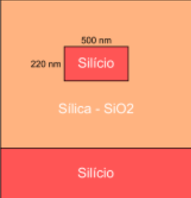
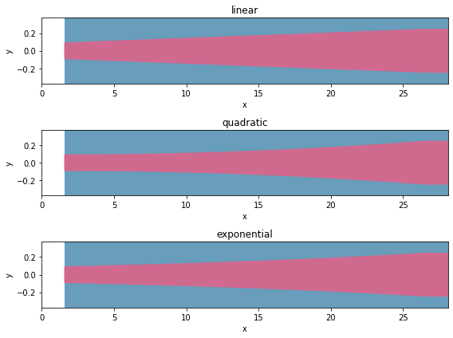
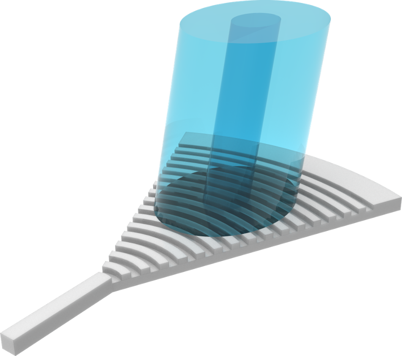
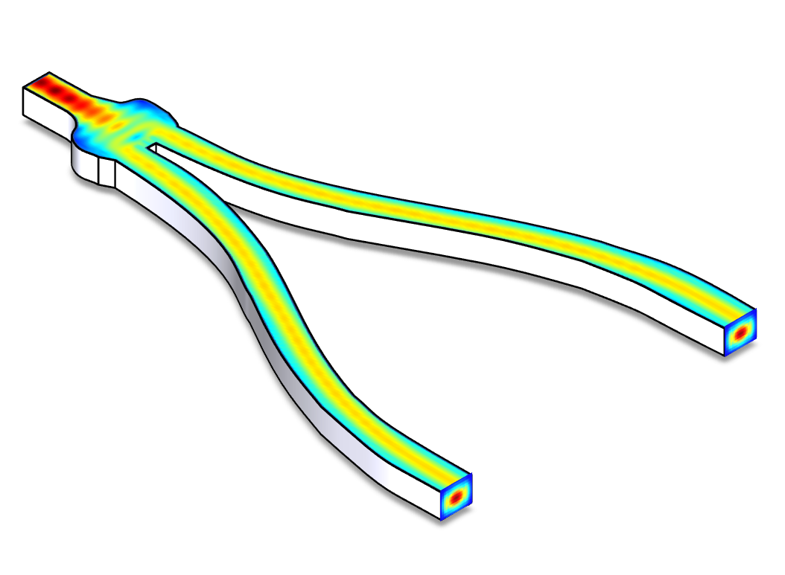
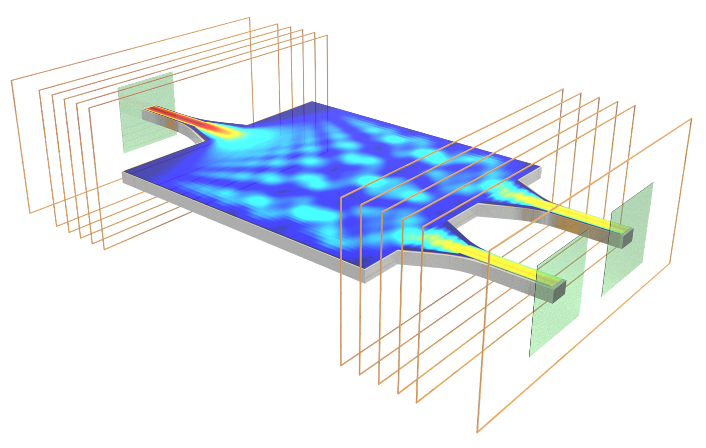
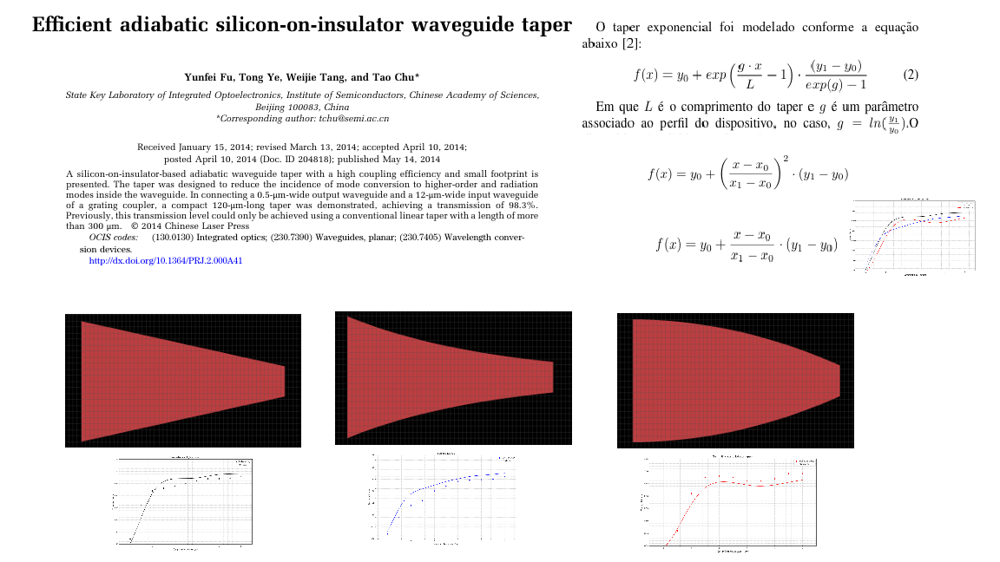
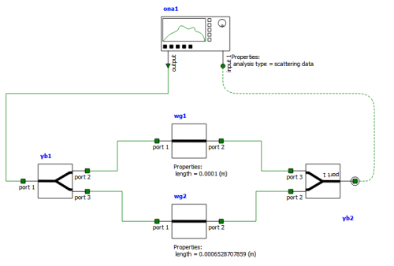
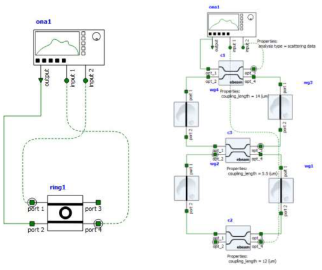
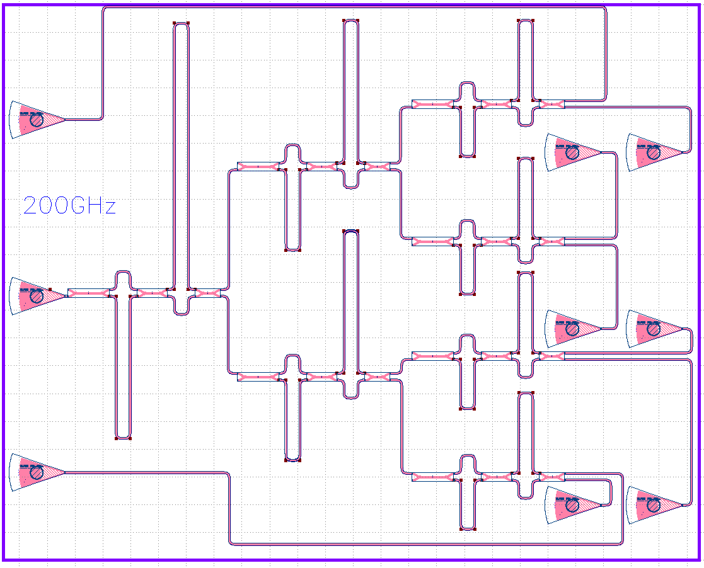
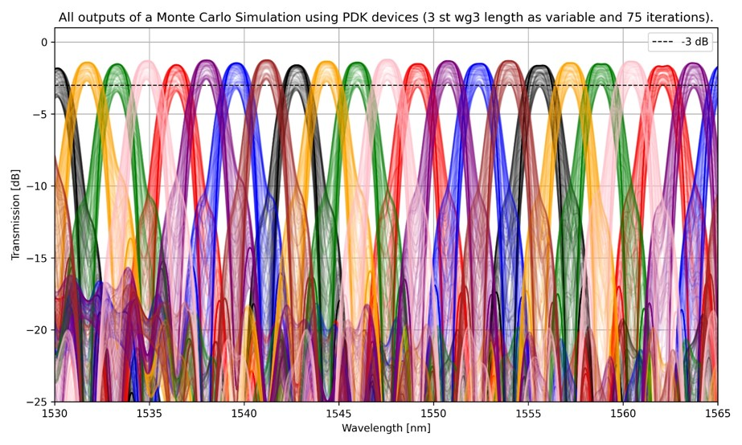

# Photonics Training Program: From Theory to Integrated Circuit Design

This photonics training program was primarily a partnership between **Virtus CC, UFCG, and other contributing companies**. The classes commenced in **June 2024**, guided by **Professor D.Sc. Adolfo Fernandes Herbster**. The core objective was to establish a solid foundation in **Maxwell's equations**, followed by in-depth exploration of **basic photonic devices** using **Ansys software**. This knowledge culminated in the design of **integrated photonic circuits** by grouping these fundamental devices. Equipped with this dense yet foundational understanding of photonics, I am now proficient in designing complex photonic circuits, from initial equations to final fabrication-ready designs and testing.

---

# Basic Theory

## Revisiting Wave Equation Fundamentals
A re-examination of Maxwell's equations to derive the wave equation, crucial for understanding electromagnetic wave propagation.

## Modal Problems
Exploration of modal properties, which describe the different ways light can propagate within a waveguide structure.

## Transmission Matrix Method (TMM)
Analytical tool used to model and analyze light propagation through layered or cascaded optical structures.

## Waveguide Properties
Detailed study of symmetric and asymmetric waveguides, including their refractive indices and confinement factors, which dictate how light is guided.

## Computational Tools Introduction
An overview of essential simulation tools:
* **EME (Eigenmode Expansion)**: Efficient for simulating light propagation through structures with varying cross-sections.
* **FDE (Finite Difference Eigenmode)**: Used for calculating modes (eigenmodes) of waveguides.
* **MODE**: A general-purpose mode solver for various waveguide geometries.
* **varFDTD (Variational FDTD)**: A 2.5D approximation of FDTD for simulating planar waveguides.
* **FDTD (Finite Difference Time Domain)**: A versatile full-wave simulation method for analyzing electromagnetic wave propagation in complex structures.

---

#  Basic Devices

### Ridge Waveguide
A fundamental waveguide structure.

### Edge Coupler
A device designed to efficiently couple light from an optical fiber into a photonic integrated circuit, typically at the chip's edge.

### Grating Coupler
An optical device that couples light into and out of a waveguide using diffraction, often allowing for perpendicular fiber coupling.

### Y-Branch
A passive power splitter that divides an optical signal from one waveguide into two output waveguides, resembling a "Y" shape.

### Directional Coupler
A passive device used to combine or split optical power between two adjacent waveguides based on wave coupling.

### Multimode Interferometer (MMI)
A compact optical power splitter or combiner that uses the self-imaging principle in a multimode waveguide section to distribute light.

---

#  Reproducing Published Results
A project focused on replicating experimental or simulation results from a chosen scientific paper, validating theoretical understanding and practical skills.

---

#  Circuits

### Mach-Zehnder Interferometer (MZI)
A versatile optical interferometer used for modulation, switching, and filtering, based on the interference of light waves traveling along two different paths.

### Ring Resonators
Compact optical resonators that confine light in a circular waveguide, enabling wavelength-selective filtering, sensing, and modulation.

### Cascaded Mach-Zehnder CWDM Filter
A complex photonic integrated circuit composed of multiple Mach-Zehnder interferometers in series, designed for efficient Coarse Wavelength Division Multiplexing (CWDM) filtering.

### Monte Carlo Simulations
Numerical simulations employing random sampling to model the behavior of complex systems, often used in photonics to analyze fabrication tolerances or statistical variations.

---

# Main References

---

### Papers

1.  Chen, G.F.R., Ong, J.R., Ang, T.Y.L. et al. "Broadband Silicon-On-Insulator directional couplers using a combination of straight and curved waveguide sections." *Sci Rep* **7**, 7246 (2017).
2.  El-Saeed, Ahmed H., et al. "Low-Loss Silicon Directional Coupler with Arbitrary Coupling Ratios for Broadband Wavelength Operation Based on Bent Waveguides." *Journal of Lightwave Technology*, vol. 42, no. 17, pp. 6011–18 (2024).
3.  Fu, Yunfei, Tong Ye, Weijie Tang, and Tao Chu. "Efficient adiabatic silicon-on-insulator waveguide taper." *Optics Express*, vol. 2, no. 3, pp. A41-A44 (2014).
4.  HORST, F., GREEN, W. M. J., ASSEFA, S., SHANK, S. M., VLASOV, Y. A., & OFFREIN, B. J. "Cascaded Mach-Zehnder wavelength filters in silicon photonics for low loss and flat pass-band WDM (de-)multiplexing." *Optics Express*, vol. 21, no. 10, pp. 11652–11658 (2013). DOI: 10.1364/OE.21.011652
5.  Lu, Zeqin, Han Yun, Yun Wang, Zhitian Chen, Fan Zhang, Nicolas A. F. Jaeger, and Lukas Chrostowski. "Broadband silicon photonic directional coupler using asymmetric-waveguide based phase control." *Optics Express*, vol. 23, pp. 3795-3808 (2015).
6.  Maese-Novo, A., Halir, R., Romero-García, S., Pérez-Galacho, D., Zavargo-Peche, L., Ortega-Moñux, A., Molina-Fernández, I., Wangüemert-Pérez, J. G., and Cheben, P. "Wavelength independent multimode interference coupler." *Optics Express*, vol. 21, pp. 7033-7040 (2013).
7.  Malka, D., Danan, Y., Ramon, Y., & Zalevsky, Z. "A Photonic 1 × 4 Power Splitter Based on Multimode Interference in Silicon–Gallium-Nitride Slot Waveguide Structures." *Materials*, vol. 9, no. 516 (2016).
8.  MELLONI, Andrea. "Synthesis of a parallel-coupled ring-resonator filter." *Optics Letters*, vol. 26, pp. 917-919 (2001).
9.  Ozcan, C., Aitchison, J.S., & Mojahedi, M. "Foundry-Processed Compact and Broadband Adiabatic Optical Power Splitters with Strong Fabrication Tolerance." *Photonics*, vol. 10, no. 1310 (2023).
10. Ren, Guanghui, Shaowu Chen, Yongpeng Cheng and Yao Zhai. "Study on inverse taper based mode transformer for low loss coupling between silicon wire waveguide and lensed fiber." *Optics Communications*, vol. 284, no. 19 (2011).
11. Wu, J. J., Shi, B. R., & Kong, M. "Exponentially tapered multi-mode interference couplers." *Chin. Opt. Lett.*, vol. 4, pp. 167–169 (2006).
12. Zhang, Yi, et al. "A compact and low loss Y-junction for submicron silicon waveguide." *Optics Express*, vol. 21, no. 1, pp. 1310-1316 (2013).
13. Zhang, Y., Al-Mumin, M., Liu, H., Xu, C., Zhang, L., LiKawWa, P. L., & Li, G. "Integrated Power Splitters for Mode-Multiplexed Signals." In *Conference on Lasers and Electro-Optics, OSA Technical Digest (online)* (Optica Publishing Group, 2018), paper JW2A.46.
14. Vilas, J., Fernández de Cabo, R., Olivares, I., González-Andrade, D., Velasco, A. V., & Dias-Ponte, A. "Low-Loss Directional Coupler for the C, L and U Bands Based on Subwavelength Gratings." *IEEE Photonics Technology Letters*, vol. 35, no. 24, pp. 1331-1334 (2023).

### Books

1.  CHROSTOWSKI, Lukas; HOCHBERG, Michael E. *Silicon Photonics Design*. Cambridge: Cambridge University Press, 2015.
2.  OKAMOTO, Katsunari. *Fundamentals of Optical Waveguides*. 3rd ed. Academic Press/Elsevier, 2022. ISBN 978-0-12-815601-8.
3.  RABUS, Dominiki G. *Integrated Ring Resonators – The Compendium*. Book, 2007.